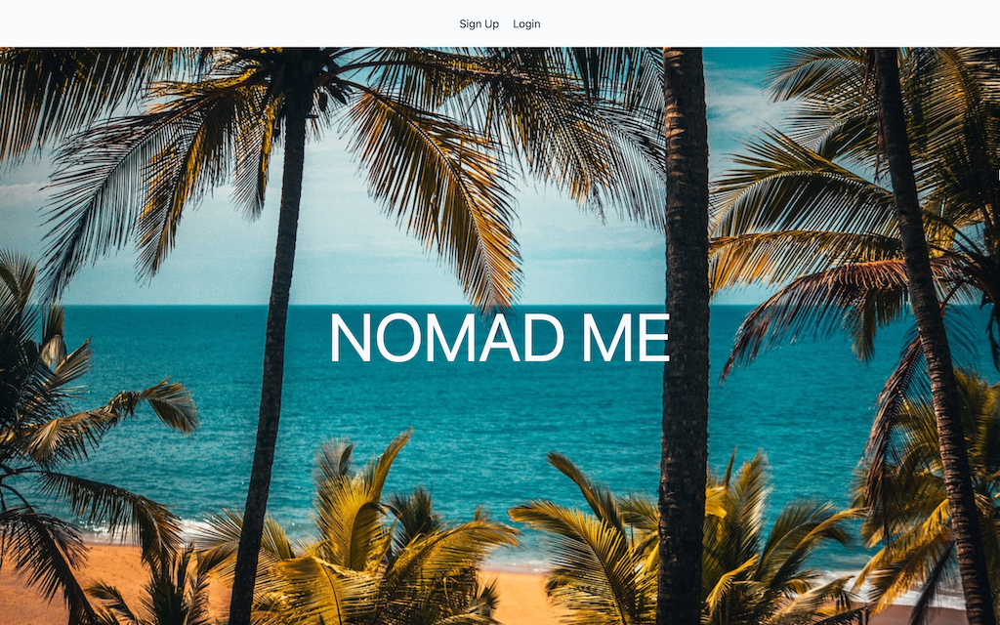
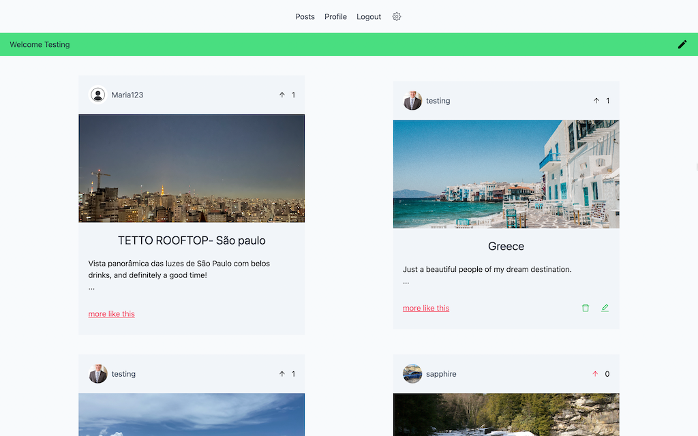
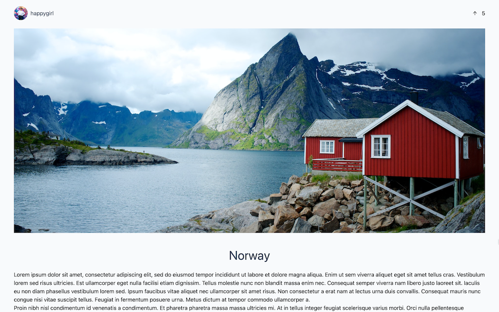
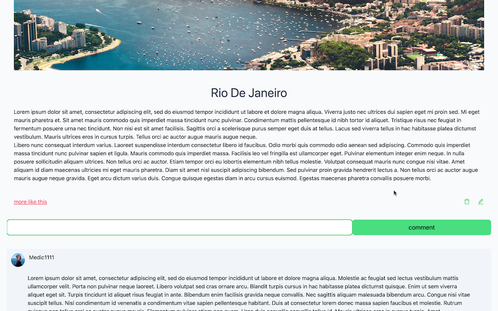

# NOMAD-ME (full-stack MERN)

A travel style social media application contained to remain a non-toxic environment, with light-hearted feedback on user's activities. Refactored version of a Travel Social Media App developed during Chingu.io 6-week program. The original was built in a team of 4 with PERN stack. This personal version on MERN stack.

[DEV-API-DOCS](./APIDOCS.md)

[LIVE MVP DEV HERE](https://nomad-me-v3.onrender.com/)






---

## The Story:

During my Chingu.io Voyage I was matched with a team of originally 4 developers. Facing life challenges we ended up completing the 6-week program in two, with a PERN Stack MVP delivered within the deadline. Although the mission was accomplished, I wanted to come up with a personal refactored version of it, built with MERN. [Here's the original](https://github.com/chingu-voyages/v40-bears-team-29) and it has a link to the live demo.

## The Results

- Reduction of additions/deletions from ~130k to ~60k 🥳.
- Same features plus additional four (label filtering system, email sending, password reset, and file upload)
  - Filtering was part of "extra features" on the original app and unfortunately we were unable to implement it. In this version, the user has the option to add tags to the posts and filter by it.
  - Image upload on the original was handled by Text Editor where the user would first need to upload the image on a third party, get the url, and upload the url. In this version Images get uploaded to the server which then stores in a cloud and stores the url in the DB.
  - Welcome emails when a user registers
  - "Forgot password" functionality
- Increased security from original keeping it limited to encryption and cookie utilization (no httpOnly), to:
  - Secured HTTP Headers
  - Rate limit against Brute force attacks
  - Data sanitization against NOSQL Query Injection
  - Preventing params/query polution
  - Encryption and Cookies httpOnly

## Compromises:

- No focus on UI although current MVP is desktop and mobile friendly whereas the original had UI with talwind integrated

## Tech Stack

- Frontend
  - React
  - CSS
- Backend
  - NodeJS
  - Express.js
- Database
  - MongoDB: mongoose applied

## What's next

- Skelleton templates for heavy loads
- Testing

## Running it

- Fork/Clone this project
- `.env` example:

```
NODE_ENV=development or production
DB_URI=YourURI
TOKEN_SECRET=TokenSecretOfChoice
CLOUDINARY_NAME=yourCloudiName
CLOUDINARY_KEY=YourCloudiKey
CLOUDINARY_SECRET=yourCloudiSecret
GRID_USERNAME=sendgridusername
GRID_PASSWORD=sendgridpassword
```

- Run `npm install` at the root to install server dependencies
- `cd client` && `npm install` to install client dependencies
- At the root, `npm run dev` to start the API
- `npm run dev-client` to start the client
